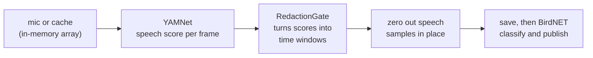

# Research Internship @ Argonne National Laboratory Notes

Notes, setup guides, and project work from my summer internship at Argonne National Laboratory, working with the Sage / Waggle edge-AI stack.

> **Published Sage application:** the standalone speech-redaction plugin built in this internship is live in the Sage app catalog at [portal.sagecontinuum.org/apps/app/mighdz/speech-redaction](https://portal.sagecontinuum.org/apps/app/mighdz/speech-redaction). Source and its own README: [github.com/Miguel-Hernandez1/speech-redaction](https://github.com/Miguel-Hernandez1/speech-redaction).

## The project

**[project.md](project.md)** - Speech Redaction at the Edge: automatic redaction of human speech on a Sage node so BirdNET can keep running at Haleakalā National Park without recording park visitors. The tested redaction modules (hysteresis gate, verified YAMNet speech classes, YAMNet wrapper) live in [code/redaction/](code/redaction/).

The redaction is now packaged as a standalone Sage plugin ([speech-redaction](https://github.com/Miguel-Hernandez1/speech-redaction)), a separate cache consumer/producer app built and published to ECR ([portal page](https://portal.sagecontinuum.org/apps/app/mighdz/speech-redaction), currently private). The full cache consume, redact, produce loop has now run end-to-end on H00F against the live media-sampler3 cache with the real YAMNet model; running it inside the plugin container on the node is the remaining step.

### What I did, at a glance

- **Found the real constraint.** The existing BirdNET node app writes every recording to disk *before* it classifies anything, so a speech filter bolted on at the end would be too late. Redaction had to happen in memory, before the file is ever saved. That one finding shaped the whole design.
- **Built and tested the redaction.** Three small Python modules that detect human speech with YAMNet and erase it: a hysteresis gate, a verified list of YAMNet's speech classes (checked against the source, not assumed), and a YAMNet wrapper. Along the way I caught and fixed a frame-timing bug that was leaving the tail of every spoken word un-redacted.
- **Designed it to fail closed.** If speech detection ever breaks, the node saves silence instead of risking a leak. Successful detection is what *permits* recording, not what triggers redaction, so there is no failure mode that quietly lets a voice through.
- **Ran it on real edge hardware and shipped it.** Validated the full pipeline on an NVIDIA Jetson AGX Thor, then refactored it into a standalone Sage plugin, containerized it, and published it to the Sage app catalog (ECR).

### How it works

This plugin never writes unredacted audio: only the redacted product is available to downstream consumers and for upload. Raw clips currently reach the node's SSD via the upstream producer (media-sampler3), with a move to a ramdisk planned. Full write-up in **[project.md](project.md)**; a plain-English walkthrough is in [docs/07](docs/07-redaction-explained.md).

### Result

Before and after on a ~21s test clip run on the Thor. The top plot is the original audio with human speech present; the bottom is the redacted output, with the detected speech zeroed (red spans) and the quiet ambient stretches left untouched. About 82% of this clip was redacted, across two merged windows. This same figure is the science image on the [Sage app page](https://portal.sagecontinuum.org/apps/app/mighdz/speech-redaction).

## Notes and guides

Docs are numbered in the order I wrote them. The first few are general setup
guides; the rest (04 onward) are the redaction project, roughly in the order
the work happened.

### Setup guides

| Guide | What it covers |
|---|---|
| [01 - sage-agent on local Ollama](docs/01-sage-agent-ollama.md) | Switching the sage-agent LLM backend from a cloud API to a local Ollama model. |
| [02 - tmux with persistent logging](docs/02-tmux-logging.md) | Keeping remote sessions alive across disconnects and saving terminal history to disk. |
| [03 - Hermes Agent on a Thor node](docs/03-hermes-on-thor.md) | Installing Hermes Agent on a Sage Thor node wired to local Ollama, plus notes on a couple of issues I ran into. |

### Redaction project

| Guide | What it covers |
|---|---|
| [04 - Audio privacy redaction](docs/04-audio-redaction.md) | Working notes for the redaction project: pipeline persistence analysis, RedactionGate design, open questions, hardware. |
| [05 - VAD hangover research](docs/05-vad-hangover-research.md) | Sourced post-speech padding numbers from WebRTC VAD, Silero/Riva, and 3GPP AMR, mapped onto the privacy-redaction cost model. |
| [06 - Agent handoff: birdnet fork](docs/06-agent-handoff-birdnet-fork.md) | Orientation for a future agent: two-repo split, real-vs-proposed status, invariants, model paths, known inconsistencies. |
| [07 - Speech redaction, explained simply](docs/07-redaction-explained.md) | Plain-English walkthrough of the redaction system with a commit-mapped timeline, for re-learning or showing others. |
| [08 - Speech redaction: possible next steps](docs/08-redaction-next-steps.md) | Options coming out of the Aug 10 presentation: evaluation data as the main unblocker, source separation, where redaction happens, sensor-level ideas, and a suggested priority order. |
| [09 - Corpus check: existing datasets](docs/09-corpus-check-datasets.md) | Whether a speech-plus-soundscape dataset already exists: closest prior work (ecoVAD), an edge-distillation follow-up, QUT-NOISE-TIMIT, and what we would reuse vs. build for our own evaluation set. |
| [10 - Cache integration: consumer and producer design](docs/10-cache-integration-design.md) | Design record for the v2-style cache consumer/producer: the media-sampler3 workflow verified on H00F, the sidecar and producer contract, provenance and capture-ts decisions, bugs caught before building, and the privacy-claim correction. |
| [11 - End-to-end verification on H00F](docs/11-end-to-end-verification.md) | First run of the full cache consume, redact, produce loop on H00F with the real YAMNet model: latency (~250 ms/clip), fail-closed confirmed in production, seen-store durability across restarts, output naming and provenance, and the two bugs the run surfaced. |
| [12 - Evaluation: recall and leaked speech](docs/12-evaluation-recall-and-leak.md) | First measurement of the detector on a synthetic set (LibriSpeech in ESC-50 beds, LUFS-normalized, SNR 0 to -20 dB, exact ground truth): recall and leaked-speech tables, the rain-masking collapse below -10 dB, and post-roll vs enter-threshold tuning. |

## Context

Sage is a distributed edge-AI platform built on Waggle nodes. The "Thor" nodes are NVIDIA Jetson AGX Thor devices (ARM64). Most of these notes are about getting AI agents running locally on that hardware using local models, so nothing has to leave the node.

## Tools

Ollama, Hermes Agent (Nous Research), Podman/Docker, tmux, Python, NumPy, YAMNet (TF Hub / LiteRT on-node), BirdNET, pywaggle, Jetson AGX Thor (ARM64), Sage / Waggle nodes, gemma4 / qwen2.5 local models, glm-5.2 via NVIDIA Build.
